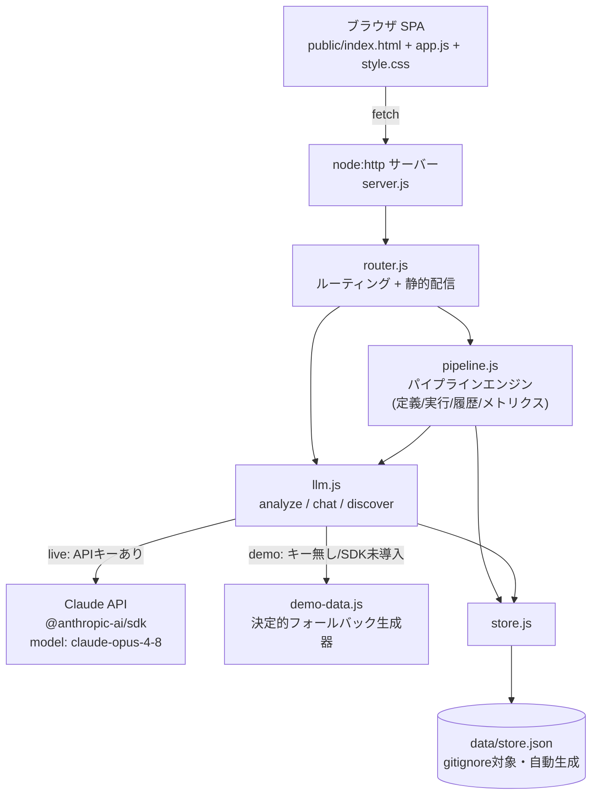

# DX Copilot

### 自動化を自分で提案するAI業務OS

`依存ゼロで起動` ・ `APIキー不要でフル動作` ・ `Claude API統合(live/demo自動切替)`

---

## これは何か

中小企業向けの「自動化を自分で提案するAI業務OS」です。

従来のRPA/ワークフローツールは、**人間が**「どこを自動化するか」を設計してからツールに落とし込みます。
DX Copilotはそこが違います。日々の業務ログをAIが分析し、自動化できる箇所を**AI自身が発見・提案**し、
ワンクリックでパイプライン化、実行し、削減できた時間をROIとして可視化します。

「導入した瞬間から自分で進化する業務自動化」——これが本プロダクトの新規性の核です。

## ハッカソン3テーマへの対応

1つのプロダクトで3テーマすべてを正面からカバーしています。

| ハッカソンテーマ | 対応モジュール | 概要 |
|---|---|---|
| ① LLM活用 | AIナレッジアシスタント | 議事録/メール/レポートをAIが構造化分析(要約・決定事項・タスク・リスク・感情)し、分析結果を文脈にしたチャットQ&Aに対応 |
| ② AI×業務自動化 | オートメーションパイプライン | トリガー→AI処理→アクションのパイプラインを定義・実行。実行履歴とROI(削減時間・削減コスト)を可視化 |
| ③ AI×新規プロダクト | **Automation Discovery Engine** | 業務ログをAIが分析し「自動化できる箇所」を発見。提案からワンクリックでパイプラインを自動生成する新規SaaS体験 |

## クイックスタート(デモモード・依存ゼロ)

APIキーなし、`npm install` すら不要で動きます。審査員のその場デモに最適です。

```bash
git clone <this-repo>
cd dxworkrepository
node server.js
```

ブラウザで `http://localhost:3000` を開くだけです。`ANTHROPIC_API_KEY` が無い場合は自動的に **demoモード** で起動し、
`src/demo-data.js` による決定的だが説得力のあるレスポンスで全機能(AI分析・チャット・パイプライン実行・自動化発見)が動作します。
画面右上のモードバッジで `demo` / `live` を確認できます。

## liveモード(Claude API連携)

実際にClaude APIを呼び出す場合は、依存パッケージのインストールとAPIキーの設定が必要です。

```bash
npm install
export ANTHROPIC_API_KEY=sk-ant-xxxxx
node server.js
```

- 既定モデル: `claude-opus-4-8`
- 環境変数 `DX_COPILOT_MODEL` でモデルを変更可能

```bash
export DX_COPILOT_MODEL=claude-opus-4-8
```

`ANTHROPIC_API_KEY` が未設定、もしくは `@anthropic-ai/sdk` が未インストールの場合は例外を握りつぶして自動的に
demoモードへフォールバックするため、liveの設定ミスでアプリが落ちることはありません。

## アーキテクチャ



- フロントはビルド不要の素のHTML/CSS/JS(CDN・外部フォント不使用)
- バックエンドはExpress不使用、`node:http` のみで依存ゼロ
- Claude API連携(`@anthropic-ai/sdk`)は唯一の依存だが、未インストールでもdemoモードで完全動作
- データは `data/store.json` に永続化(初回起動時にシードデータを自動投入)

## API一覧

すべてJSON。エラーは `{ error: string }` + 適切な4xx/5xx。

| Method/Path | リクエスト | レスポンス |
|---|---|---|
| GET `/api/health` | - | `{ status, mode, version }` |
| POST `/api/analyze` | `{ text, type? }`(type: `"minutes"\|"email"\|"report"` 既定 minutes) | `{ summary, decisions: string[], tasks: [{title, assignee, due, priority}], risks: string[], sentiment: "positive"\|"neutral"\|"negative" }` |
| POST `/api/chat` | `{ messages: [{role:"user"\|"assistant", content}], context? }` | `{ reply }` |
| GET `/api/pipelines` | - | `{ pipelines: [Pipeline] }` |
| POST `/api/pipelines` | `{ name, description?, trigger, steps: [{name, type, config?}] }` | `{ pipeline }`(201) |
| POST `/api/pipelines/:id/run` | `{ input? }` | `{ run }`(Run: `{ id, pipelineId, startedAt, durationMs, savedMinutes, status: "success"\|"failed", steps: [{name, status, output}] }`) |
| GET `/api/runs` | - | `{ runs: [Run] }`(新しい順) |
| GET `/api/metrics` | - | `{ totalRuns, successRate, savedMinutes, savedCostYen, automationRate, weeklyTrend: number[7] }` |
| POST `/api/discover` | `{ logs? }`(省略時は内蔵サンプル業務ログを使用) | `{ suggestions: [{ id, title, description, estimatedSavingMinutesPerWeek, confidence, pipelineTemplate: {name, trigger, steps} }] }` |
| POST `/api/discover/:suggestionId/adopt` | - | `{ pipeline }`(提案からパイプライン生成、201) |

ステップ種別の例: `"ai_summarize" | "ai_classify" | "ai_draft" | "notify" | "assign" | "archive"`。
`ai_*` ステップはliveモードならClaude API、demoモードなら`demo-data.js`を経由して出力を生成します。

## テスト

```bash
npm test
```

`node --test test/` を実行します。`src/pipeline.js` / `src/store.js` のユニットテストと、サーバーを起動して主要エンドポイントを叩く統合テストで構成されており、
APIキーが無い環境(demoモード)でも全テストが決定的に通ります。

## ディレクトリ構成

```
server.js              # エントリポイント (node server.js, PORT=3000既定)
src/llm.js              # Claude APIクライアント + demoフォールバック
src/demo-data.js        # demoモードのレスポンス生成器
src/pipeline.js         # パイプラインエンジン
src/store.js            # JSONファイル永続化
src/router.js           # ルーティング + 静的ファイル配信
public/                 # SPA (index.html / app.js / style.css)
test/                   # node:test
data/                   # gitignore対象 (.gitkeep のみコミット)
docs/PITCH.md           # 5分ピッチ台本
docs/DEMO.md            # 審査員向けデモ手順
```
